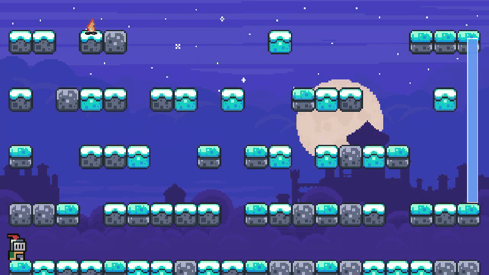
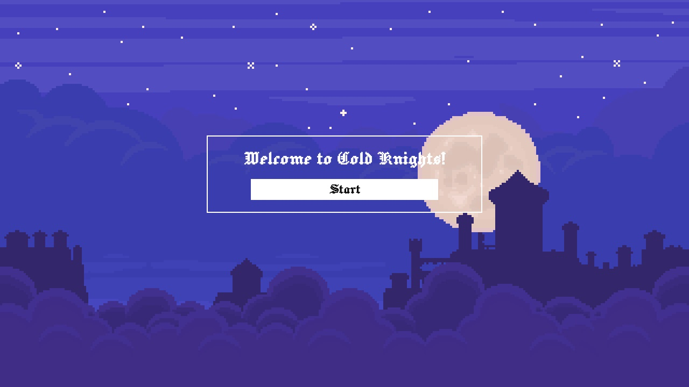
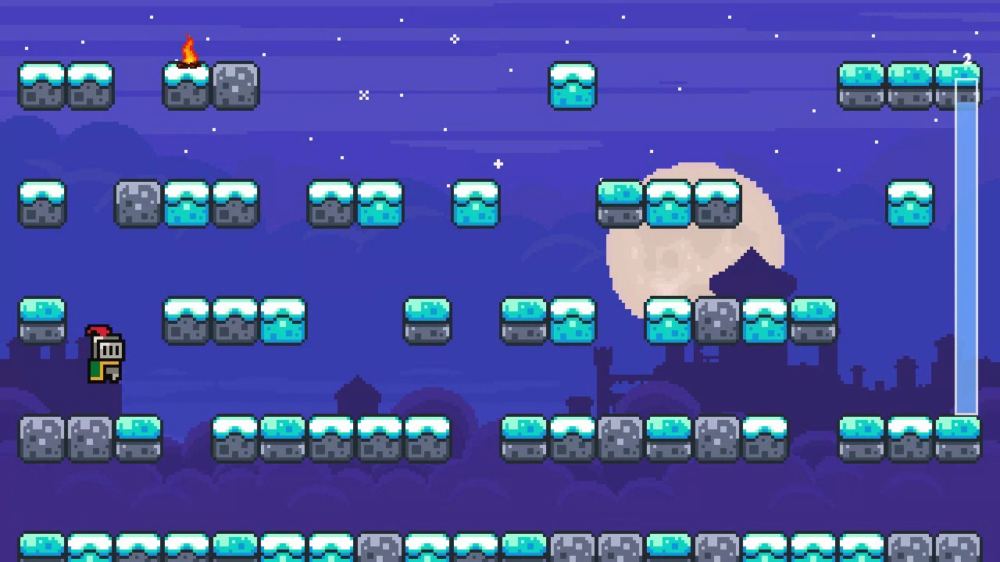
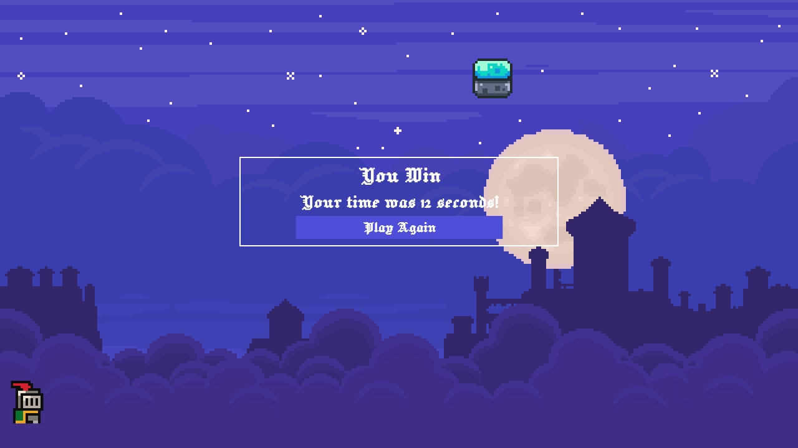

# Cold Knights

Cold Knights is a small browser platform game. Guide the knight across the floating platforms and reach the campfire before the cold timer runs out.

**Play it:** [cold-knights.vercel.app](https://cold-knights.vercel.app) (desktop only, it needs a keyboard)



## Objective
You are a knight who is freezing, and needs to get to the campfire to warm up. Make it to the campfire before the timer runs out.

## Controls

| Key | Action |
|---|---|
| ← → | Move |
| Space | Jump |

## Features

- A new level every game: the platforms and the campfire are placed at random, and the number of layers depends on the window size
- A 30-second cold meter that drains while you play
- Gravity, jumping and platform collision written from scratch
- Sprite animation for standing, running, jumping, falling and dying
- Start screen, win and lose screens, and your time when you win

| Start | Playing | Win |
|---|---|---|
|  |  |  |

## Run Locally

1. Install [Node.js](https://nodejs.org/) if it is not already installed.
2. Open a terminal in the project folder.
3. Start a local Node.js server:

   ```bash
   npx http-server public -p 8000
   ```

4. Open [http://localhost:8000](http://localhost:8000) in a browser.
5. Click **Start** to begin.

## Project Structure

```text
public/index.html                    Main game page
public/images/                       Game artwork and sprites
public/scripts/game.js               Game logic and controls
public/scripts/jquery-3.7.1.min.js   jQuery dependency
public/styles/styles.css             Layout and visual styles
```

## Technologies

- HTML
- CSS
- JavaScript
- jQuery
